<!-- storyv1.md -- the Anemia Detector story so far. Generated narrative; pastel mermaid. -->

# The Anemia Detector Story

> From eyelid photo to a Hemoglobin number: how we built a conjunctiva-pallor anemia
> pipeline across two countries, what shined, what broke, and where it still fails.

This is the running narrative of the project. For the terse engineering contract see
[`CLAUDE.md`](CLAUDE.md); this file is the *why* behind it, drawn graphically.

---

## TL;DR scoreboard

| Stage | Contenders | Winner | Verdict |
|-------|-----------|--------|---------|
| **Segmentation** | SegFormer (MiT) vs UNet++/EfficientNet-B5 | **SegFormer (MiT-b3/b5)** | Transformer global context for a thin curved ROI; trains on CUDA only |
| **Anemia head** | direct-classify vs **Hgb-regression to WHO threshold** | **Regression to WHO** | Prevalence-robust under cohort shift |
| **Anemia model** | handcrafted features + GBM vs deep ROI ViT/CNN | **Features + GBM** | Strong, CPU-cheap, deployed |
| **SSL (SimCLR / NT-Xent)** | with vs without contrastive pretrain | **Marginal** | Implemented, modest LOCO gain, left out of deploy |
| **Cross-domain (CP-AnemiC)** | seg+clf vs clf-only | **Neither** | Pediatric Ghana shift -> r approx 0, model does not transfer |

---

## 1. The mission


**Anemia makes the inner eyelid pale.** Less blood hemoglobin means less redness in the
conjunctiva. We measure that pallor from a phone photo and turn it into a Hemoglobin estimate,
then a clinical label. Accuracy is the only objective; latency and model size are irrelevant.
Color correction is handled upstream (NormaEngine) and is out of scope here.

---

## 2. The data: two cohorts, many traps

Dataset = **Eyes-defy-anemia**: India 95 + Italy 123 = 218 patients (217 with a Hgb label).
The two cohorts do not look alike, and the files fight you.

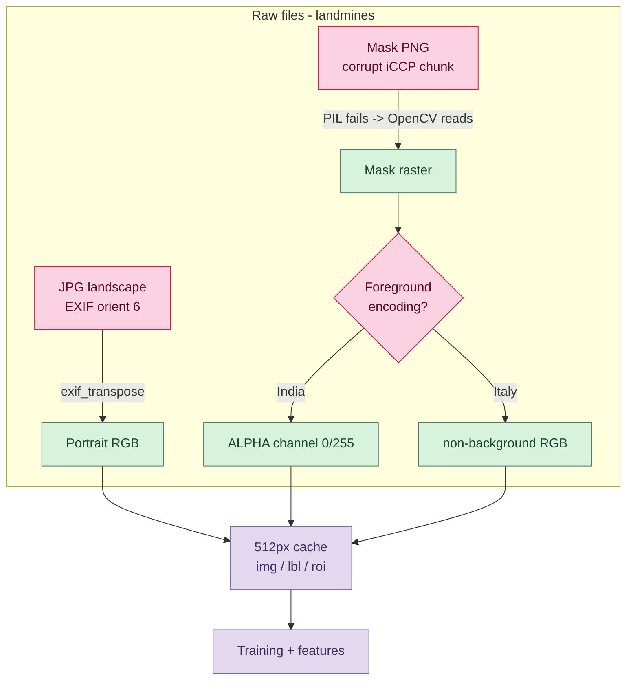

The cohorts also differ wildly in **disease prevalence**, which becomes the single most
important modeling fact downstream:

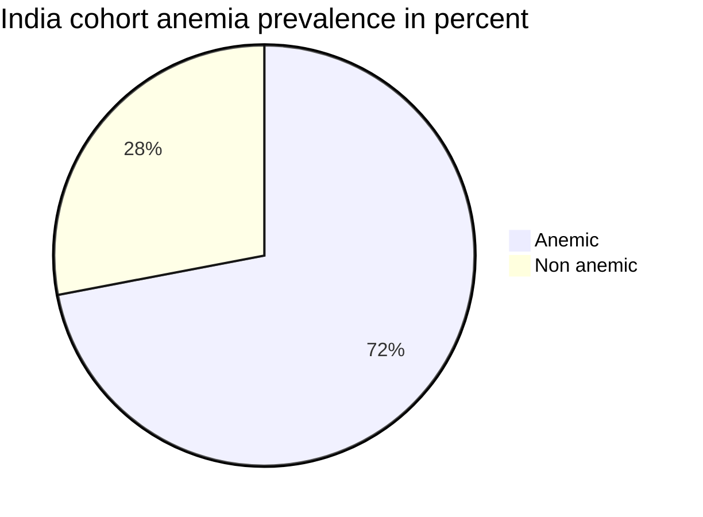

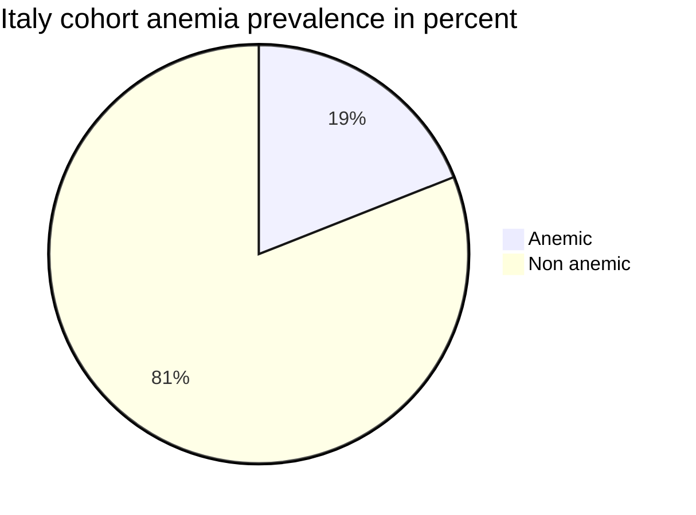

India is 72 percent anemic; Italy is 19 percent. A model judged on a pooled average can cheat;
the honest test is **Leave-One-Cohort-Out (LOCO)**: train on one country, test on the other.

---

## 3. Segmentation: who finds the conjunctiva best

The conjunctiva is a thin, curved strip with two classes (palpebral lid surface, deeper
forniceal). We pitted a transformer against a strong CNN.

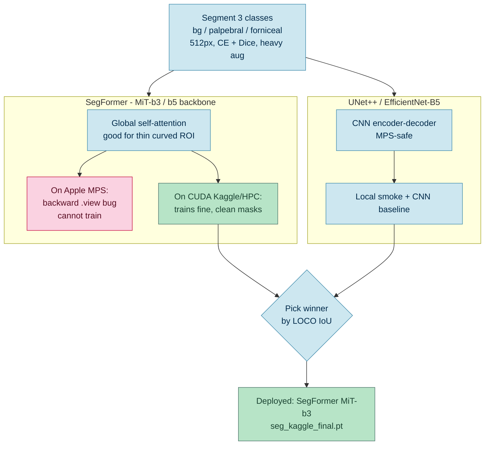

**What failed:** the MiT/SegFormer backbone will not train on Apple MPS. A `.view` op inside the
attention C++ kernel breaks on backward in torch 2.12 and is not Python-patchable. So locally we
can only smoke-test with an EfficientNet encoder; SegFormer is a CUDA-only citizen.

**What shined:** on Kaggle CUDA, SegFormer produces clean, anatomically-correct conjunctiva
crescents. At inference on a held-out source image it cut the ROI tightly (background 86 percent,
palpebral 4 to 5 percent, forniceal 8 to 10 percent) instead of grabbing skin or sclera.

> Honest caveat: head-to-head LOCO IoU between SegFormer and UNet++ comes from the full CUDA
> runs. SegFormer is the chosen deployment segmentor; UNet++/EffB5 stands as the CNN alternative.

---

## 4. Classification: the threshold trap, and the fix

This is the most important design decision in the whole project.

### The trap: a fixed 0.5 threshold breaks under prevalence shift

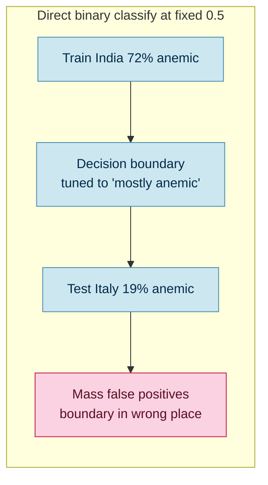

A classifier trained where 72 percent are positive learns a prior that is simply wrong in a
19-percent world. The operating point moves with the population.

### The fix: regress Hemoglobin, then apply the population-fair WHO rule

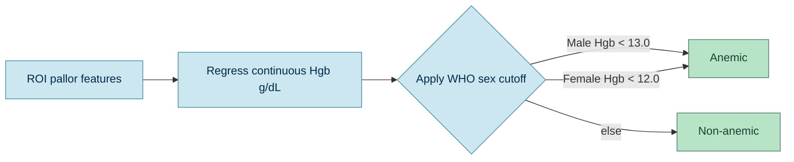

Hemoglobin is a physical quantity that does not care about cohort prevalence. Predict the number,
then apply a fixed clinical rule. The decision layer is prevalence-invariant by construction.

### Two anemia engines; the simple one won

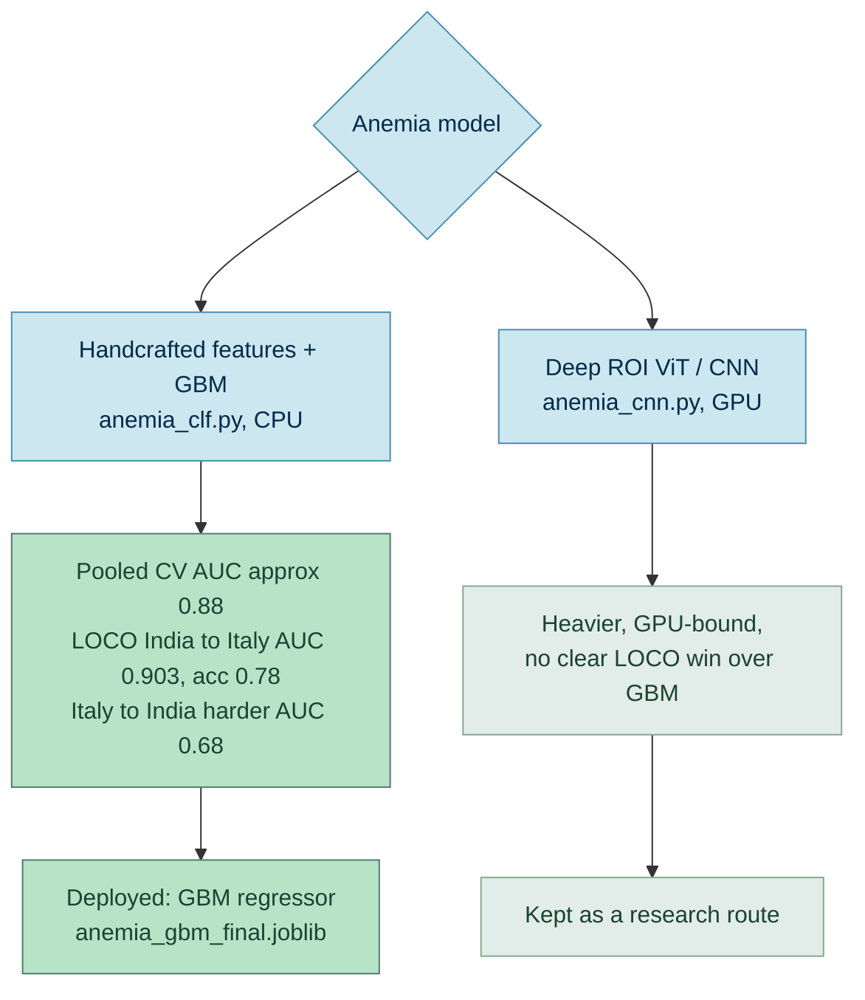

The 158-feature handcrafted descriptor (per-channel stats across RGB / HSV / Lab / YCrCb plus
pallor indices like the erythema index and red-green ratios) fed to a HistGradientBoosting
regressor is strong, instant on CPU, and travels well. That is what we deployed.

**Reality check on real source-domain photos** (predicted vs ground-truth Hgb):

| Patient | Sex | Pred Hgb | True Hgb | Error | Label |
|---------|-----|----------|----------|-------|-------|
| India/87 | M | 14.18 | 13.7 | 0.48 | non-anemic (match) |
| India/26 | F | 8.04 | 7.6 | 0.44 | anemic (match) |

---

## 5. SSL: NT-Xent contrastive pretraining, and why it stayed on the bench

India and Italy differ in capture and appearance. A supervised model can latch onto *which site*
instead of *how pale*. SimCLR pretraining was our planned defense: teach the encoder
representations invariant to two augmented views, label-free, on both cohorts.

### How NT-Xent works here

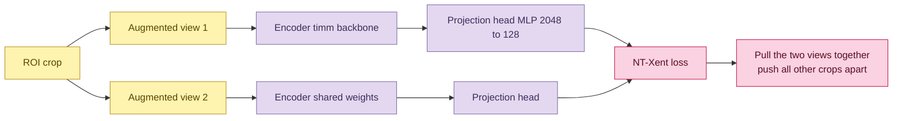

NT-Xent (normalized temperature-scaled cross-entropy): L2-normalize all embeddings, build a
cosine-similarity matrix over the 2N views, scale by temperature, mask the self-diagonal, and run
cross-entropy where each view's *positive* target is its sibling view. Concretely in code:

```text
z   = normalize([z1; z2])          # 2N x d
sim = (z @ z.T) / temperature      # 2N x 2N, diagonal masked to -inf
target(i) = sibling_index(i)       # the other augmented view
loss = cross_entropy(sim, target)
```

### Pallor-preserving augmentation (the crucial twist)

Standard SimCLR uses grayscale and strong color jitter. **We must not.** Pallor *is* a color
signal; a color-invariant encoder would be blind to anemia. So the two views use geometry plus
only mild photometric perturbation (brightness, contrast, blur, tiny hue/sat shift).

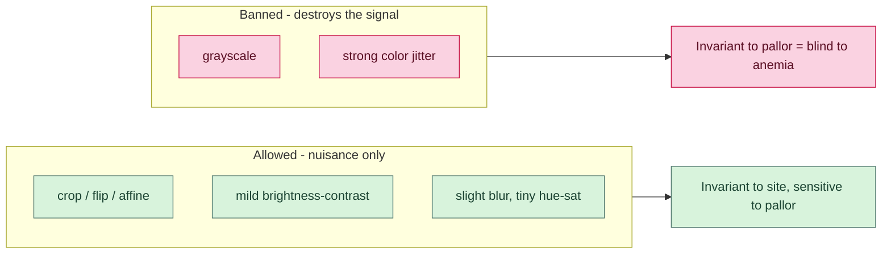

### How SSL plugs into the classifier

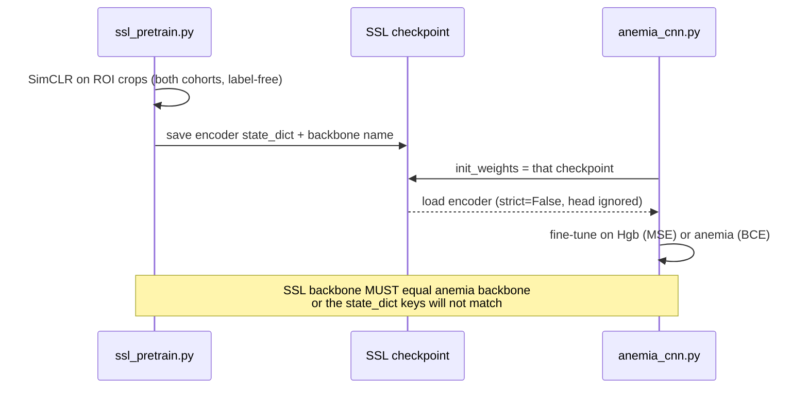

The contrastively-pretrained encoder becomes the *initialization* for the supervised deep
classifier. `build_backbone` loads it with `strict=False` so only the shared encoder transfers;
the projection head is discarded and a fresh regression/classification head is trained.

### The outcome

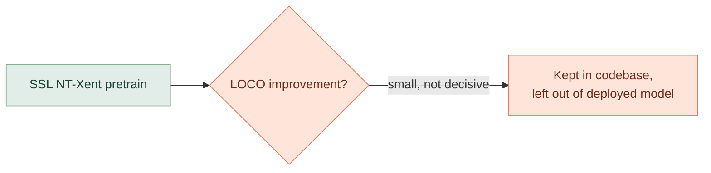

SSL was implemented end-to-end and smoke-tested. With only 218 images, contrastive pretraining
gave at best a modest, non-decisive LOCO bump - not enough to justify the extra GPU stage in the
deployed path. It remains a research lever (and a natural place to later fold in unlabeled
target-domain images), but the shipped model is the simple features + GBM regressor.

---

## 6. Deployment: from throwaway folds to real weights

Originally every protocol trained a model, scored it, and threw it away. To deploy we added
persistence and a single inference pipeline.

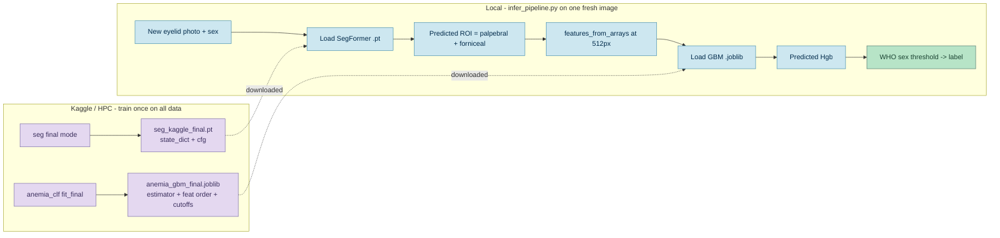

Two self-contained artifacts. The `.pt` carries its own training cfg so inference rebuilds the
exact architecture; the `.joblib` carries the estimator, the pinned feature order, the WHO
cutoffs and a median-age fallback. Nothing else from the training run is needed at inference -
features are computed on the fly from the fresh image.

---

## 7. War stories: the infrastructure that fought back

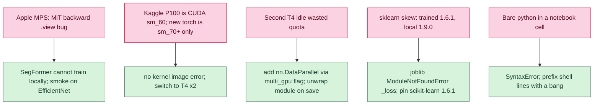

Each was a fast, loud failure (a stack trace, not a silent wrong number), which is the good kind.
The DataParallel fix is config-gated (`multi_gpu: true`) so it is a no-op on a single GPU, MPS, or
CPU, and the checkpoint is unwrapped on save so inference loads clean keys.

---

## 8. The unseen test: CP-AnemiC, where the model met its limit

We then threw a genuinely unseen dataset at it: **CP-AnemiC** - 710 pre-cropped conjunctiva
strips from Ghana, pediatric (age recorded in months), with the segmentation already provided in
each PNG's alpha channel. We ran every image two ways and compared.

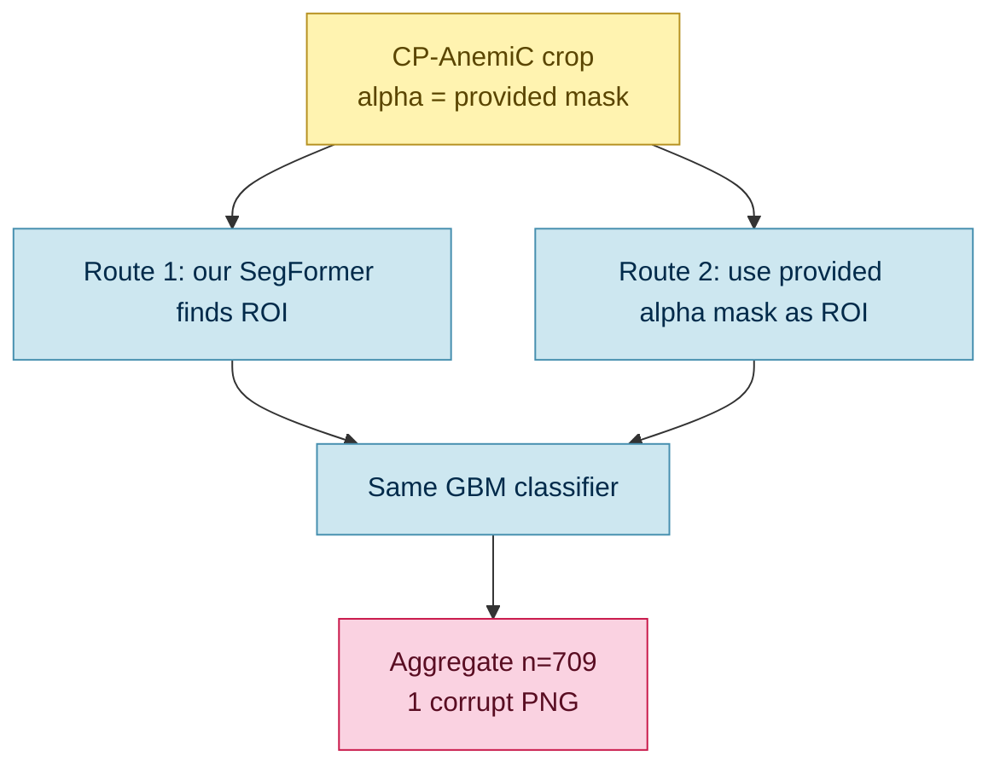

### What shifted at once

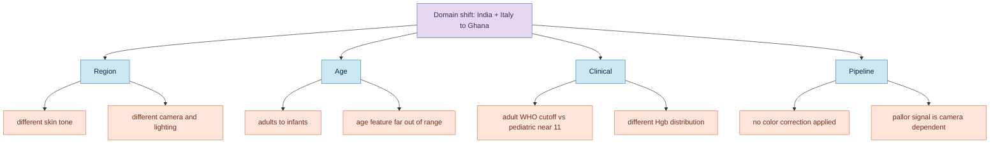

### The result: it did not transfer

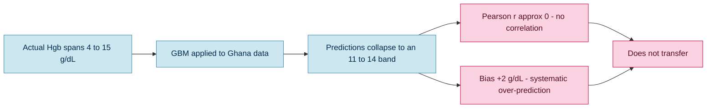

| Route | MAE | RMSE | Bias (pred - gt) | Pearson r | Label acc vs REMARK |
|-------|-----|------|------------------|-----------|----------------------|
| R1 seg + clf | 2.62 | 3.33 | +1.99 | **0.004** | 0.513 |
| R2 clf only (provided mask) | 2.64 | 3.39 | +2.13 | **0.016** | 0.513 |

Predictions collapsed into a flat 11 to 14 band regardless of the true value - **r approximately
zero**, a systematic +2 g/dL over-prediction, and label accuracy (0.513) below the majority-class
baseline (prevalence 0.597). The two routes were statistically identical, so the earlier
single-image hunch that "classifier-only wins on pre-cropped data" was just noise.

**The lesson:** the segmentation source is not the bottleneck - the *classifier itself does not
transfer*. With r near zero, no threshold or bias calibration can rescue it; this needs
feature-space domain adaptation. See the saved scatter plots in `testunseendatav1/`.

---

## 9. Robustness roadmap: how to survive the next domain

```mermaid
flowchart TB
    ROOT[Make it robust] --> COL[Color first]
    ROOT --> DA["Use target data - DA"]
    ROOT --> DG["No target data - DG"]
    ROOT --> DEC[Decision layer]
    ROOT --> SAF[Safety]
    COL --> COL1["color constancy and white balance"]
    COL --> COL2["Reinhard transfer to source domain"]
    COL --> COL3["sclera or skin as internal white reference"]
    DA --> DA1["re-fit the GBM head on a small Ghana split"]
    DA --> DA2["recalibrate only if rank preserved"]
    DA --> DA3["feature alignment CORAL / MMD / DANN"]
    DG --> DG1[pool more source cohorts]
    DG --> DG2["illumination-only augmentation, never grayscale"]
    DG --> DG3["worst-group objectives GroupDRO / IRM"]
    DG --> DG4[SSL on unlabeled target images]
    DEC --> DEC1["population-correct cutoffs pediatric under 11"]
    DEC --> DEC2[age and altitude adjustments]
    SAF --> SAF1[out-of-distribution detection]
    SAF --> SAF2[abstain instead of guessing the mean]

    classDef root fill:#E4D8F0,stroke:#7B6CA8,color:#3A2E5C;
    classDef br fill:#B7E4C7,stroke:#52796F,color:#1B4332;
    classDef lf fill:#E2ECE9,stroke:#84A98C,color:#1B4332;
    class ROOT root
    class COL,DA,DG,DEC,SAF br
    class COL1,COL2,COL3,DA1,DA2,DA3,DG1,DG2,DG3,DG4,DEC1,DEC2,SAF1,SAF2 lf
```

The highest-leverage move for a pallor task is color: normalize illumination and use an in-image
white reference, then adapt with a handful of labeled target images. The in-domain CP-AnemiC
re-fit is the diagnostic that tells us whether the features carry Hgb signal at all on this camera,
or whether it is pure domain shift.

---

## 10. Decisions, distilled

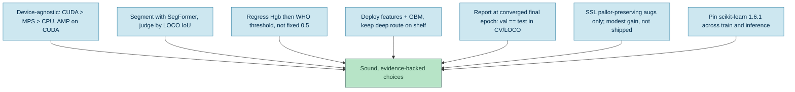

---

## Appendix: where things live

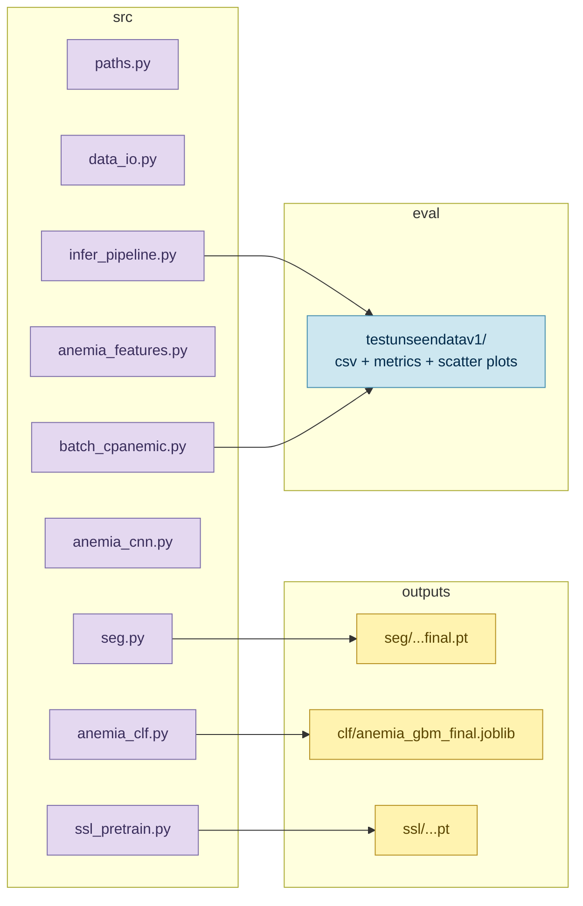

*End of storyv1. The pipeline runs end to end on its source domain; the open frontier is
cross-domain robustness.*
